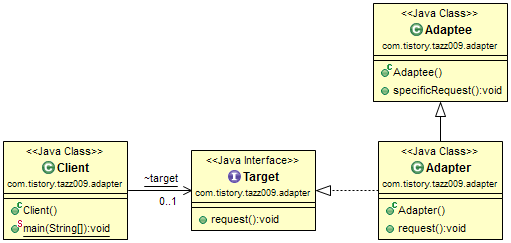

## Adapter Pattern(클래스 어댑터 패턴)
- 한 클래스의 인터페이스를 클라이언트에서 사용하고자 하는 다른 인터페이스로 변환한다.
- 어댑터를 이용하면 인터페이스의 호환성 문제 떄문에 같이 쓸 수 없는 클래스를 연결해 쓸 수 있다.

## 클래스 어댑터 패턴
- 클래스 어댑터 패턴은 다중 상속을 지원하지 않는 Java나 C#에선 사용할 수 없다. 물론 구현하려는(implement) 대상이 interface라면 편법을 이용하여(super.methodA()) 구현할 수 있으나 상속(Generalzation)을 활용하기 때문에 유연하지 못하다는 단점이 있다. 그러나 장점으로는 어댑터 전체를 다시 구현할 필요가 없기 때문에 코드를 빠르게 작성할 수 있다.

