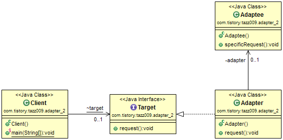

## Adapter Pattern(객체 어댑터 패턴)
* 한 클래스의 인터페이스를 클라이언트에서 사용하고자 하는 다른 인터페이스로 변환한다. 
* 어댑터를 이용하면 인터페이스의 호환성 문제 떄문에 같이 쓸 수 없는 클래스를 연결해 쓸 수 있다.

## 객체 어댑터 패턴
* 객체 어댑터 패턴은 Strategy Pattern과 유사하게 Composition을 활용하여 구성하는 특징이 있다. 이때문에 사용하기에 더 뛰어나고 유연하기도 하다. 그러나 어댑터 클래스의 대부분의 코드를 구현해야 하기 때문에 효율적이지 못하다.

